# Architecture Diagrams

**Project:** AI-Based Soldier Survival & Emergency Detection System

---

## 1. Event-Driven Architecture Diagram

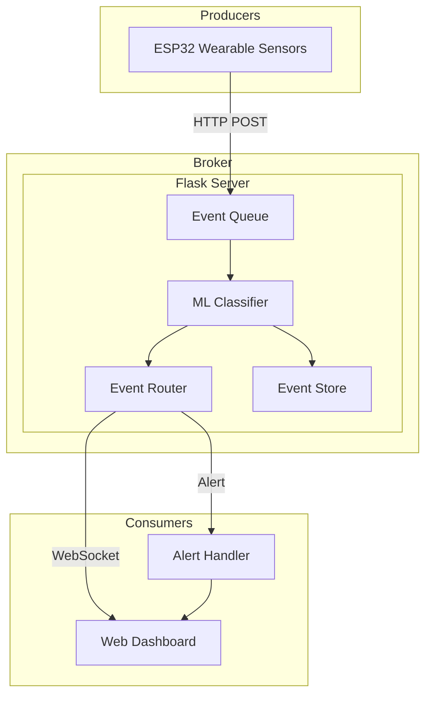

---

## 2. On-Device Processing Pipeline

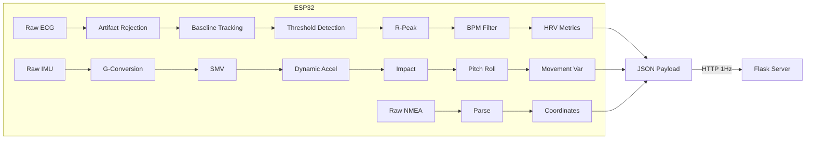

---

## 3. ML Pipeline Architecture

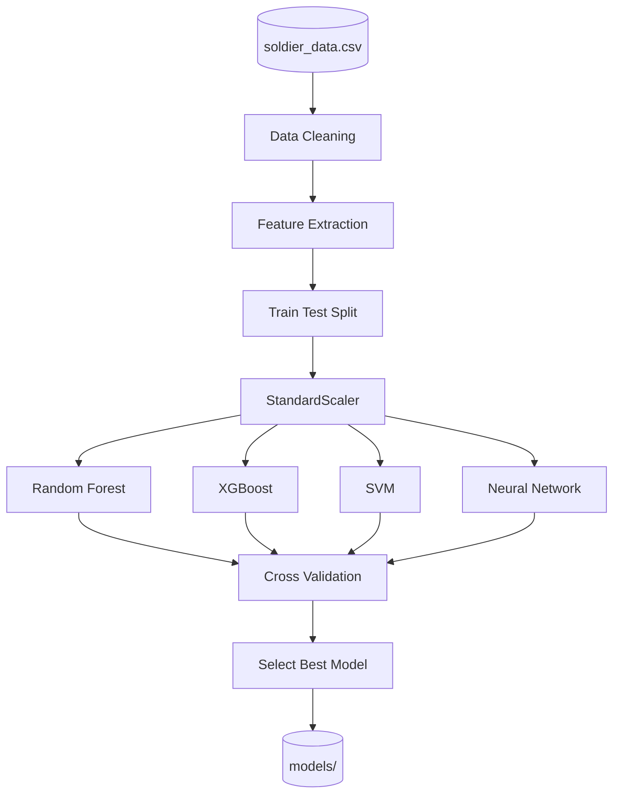

---

## 4. Real-Time Inference Flow

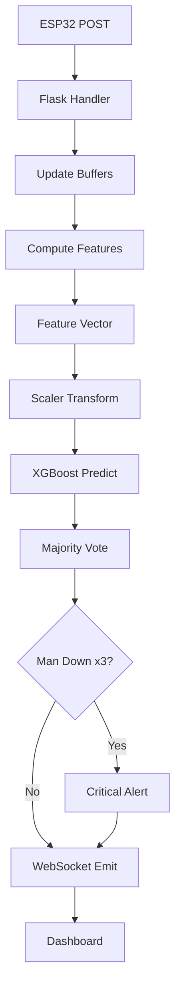

---

## 5. Use Case Diagram

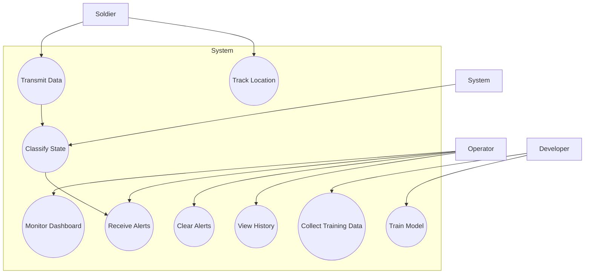

---

## 6. Class Diagram

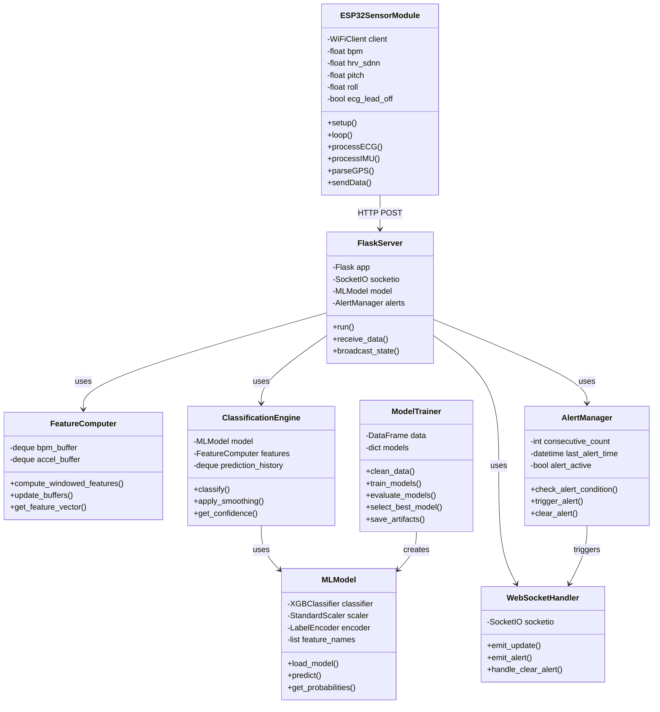

---

## 7. Data Flow Diagram - Level 0

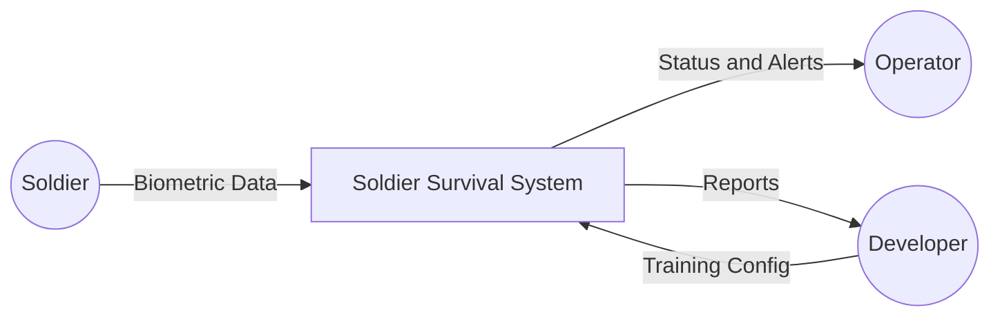

---

## 8. Data Flow Diagram - Level 1

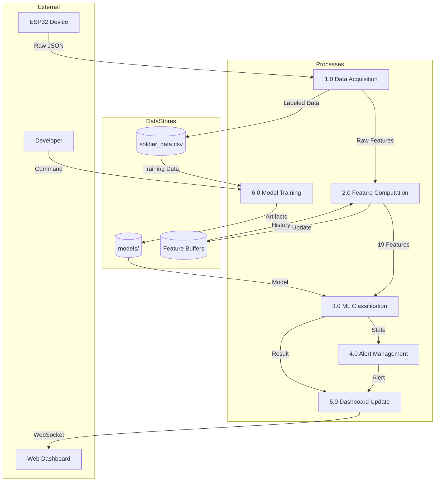

---

## 9. Component Diagram

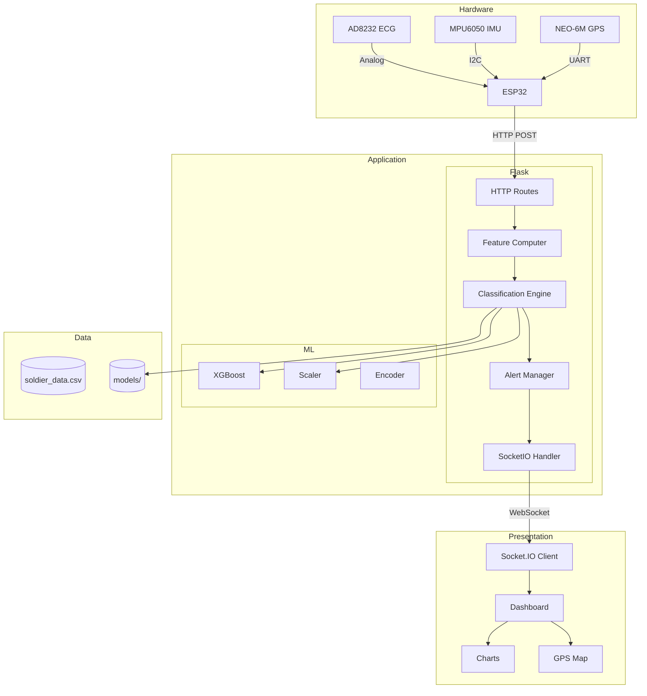

---

## 10. Sequence Diagram - Real-Time Classification

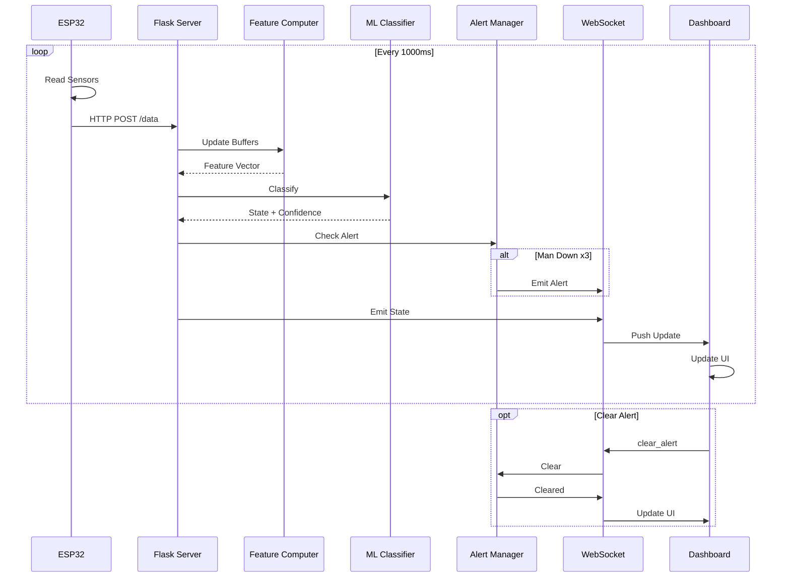

---

## 11. Sequence Diagram - Model Training

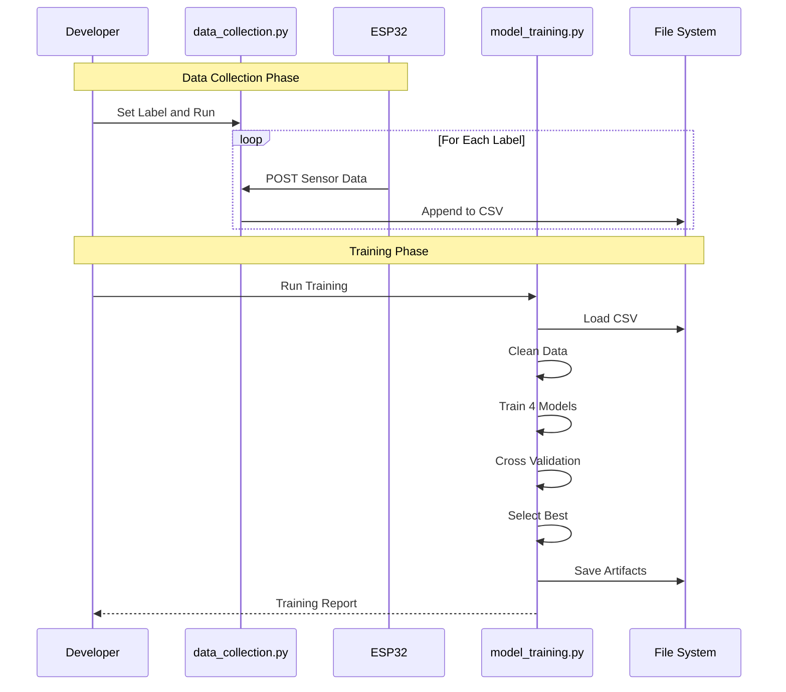

---

## 12. Deployment Diagram

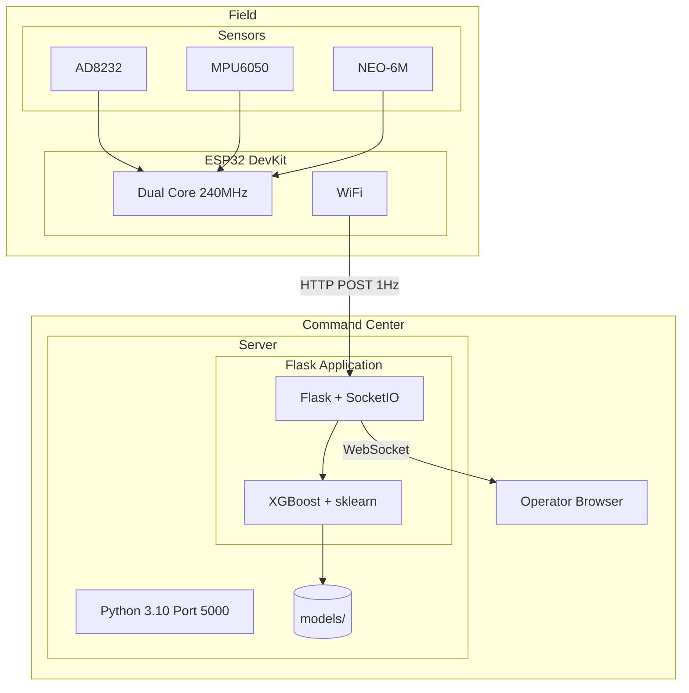

---

## 13. ER Diagram

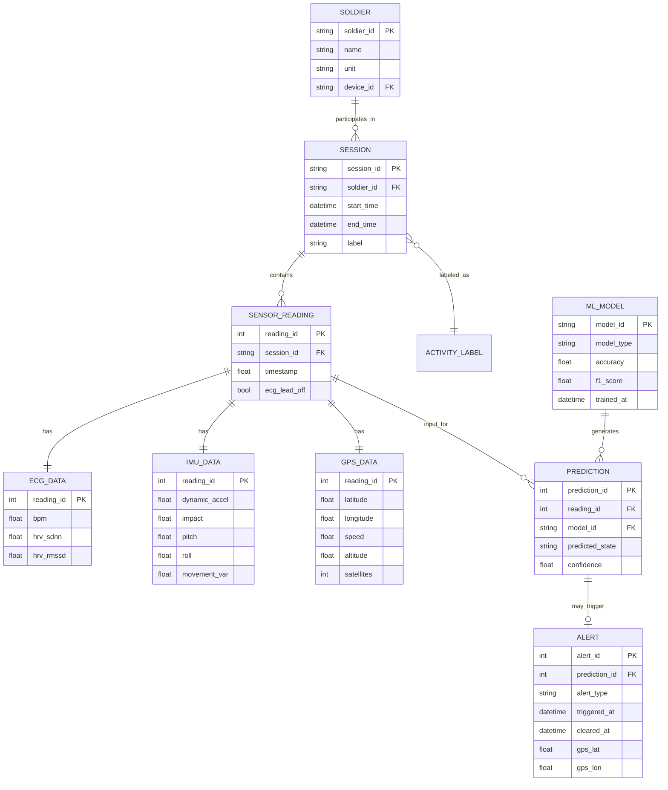

---

## 14. Data Exchange Diagram

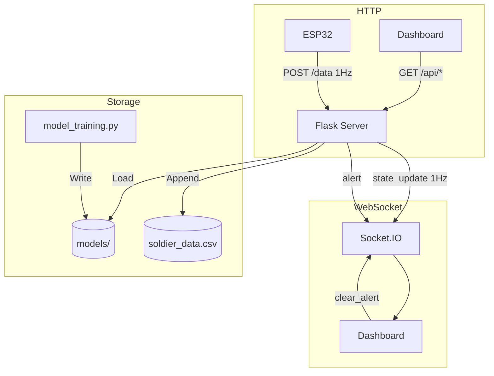

---
