# Architecture Document

**Project Title:** AI-Based Soldier Survival & Emergency Detection System  
**Version:** 1.0  
**Date:** March 5, 2026

---

## Table of Contents

1. [Architecture Selection: Event-Driven Architecture](#1-architecture-selection-event-driven-architecture-eda)
2. [Three-Tier Architecture](#2-three-tier-architecture)
3. [Hardware Architecture](#3-hardware-architecture)
4. [Software Architecture](#4-software-architecture)
5. [Data Architecture](#5-data-architecture)
6. [Communication Protocols](#6-communication-protocols)
7. [Technology Stack Summary](#7-technology-stack-summary)
8. [Use Case Diagram](#8-use-case-diagram)
9. [Class Diagram](#9-class-diagram)
10. [Data Flow Diagram](#10-data-flow-diagram)
11. [Component Diagram](#11-component-diagram)
12. [Sequence Diagram](#12-sequence-diagram)
13. [Deployment Diagram](#13-deployment-diagram)
14. [ER Diagram](#14-er-diagram)
15. [Schema Design](#15-schema-design)
16. [Data Exchange Contract](#16-data-exchange-contract)

---

## 1. Architecture Selection: Event-Driven Architecture (EDA)

For this AI-Based Soldier Survival & Emergency Detection System, we have selected **Event-Driven Architecture (EDA)** as the primary architectural pattern.

### Why Event-Driven Architecture?

| Factor | Justification |
|--------|---------------|
| **Real-Time Requirements** | Soldier state changes (Normal → High Exertion → Man Down) must be detected and communicated instantly. EDA's publish-subscribe model enables immediate event propagation. |
| **Loose Coupling** | Sensors, processing layer, and dashboard operate independently. The ESP32 doesn't need to know about the ML model; it just publishes sensor events. |
| **Asynchronous Processing** | Sensor data arrives continuously at 1 Hz. EDA allows the system to process events asynchronously without blocking. |
| **Scalability** | EDA naturally supports multiple soldiers (event producers) and multiple dashboards (event consumers) without architectural changes. |
| **Fault Tolerance** | If the dashboard disconnects, the server continues processing; when it reconnects, it receives the latest state. |
| **Alert-Driven Actions** | Critical events (Man Down) trigger immediate alerts — a fundamental EDA use case. |

### Architecture Comparison

| Architecture | Suitability | Reason |
|--------------|-------------|--------|
| **Event-Driven** ✓ | **Best Fit** | Real-time sensor events, asynchronous processing, alert broadcasting |
| Microservices | Overkill | Single-node deployment; no need for distributed service mesh |
| Serverless | Not Suitable | Requires persistent connections (WebSocket), continuous processing |
| Monolithic | Partial Fit | Currently implemented as monolith, but follows EDA patterns internally |

### Event Types in the System

| Event Type | Producer | Consumer | Payload | Frequency |
|------------|----------|----------|---------|-----------|
| `sensor_data` | ESP32 | Flask Server | JSON with 19 sensor readings | 1 Hz |
| `classification_result` | ML Pipeline | Dashboard | State, confidence, vitals | 1 Hz |
| `status_change` | Classification Engine | Dashboard, Alert System | Previous state, new state | On change |
| `alert_triggered` | Alert Manager | Dashboard | Alert type, timestamp, GPS | On critical event |
| `alert_cleared` | Dashboard (user) | Server | Alert ID, clear timestamp | On user action |

### Architecture Diagram

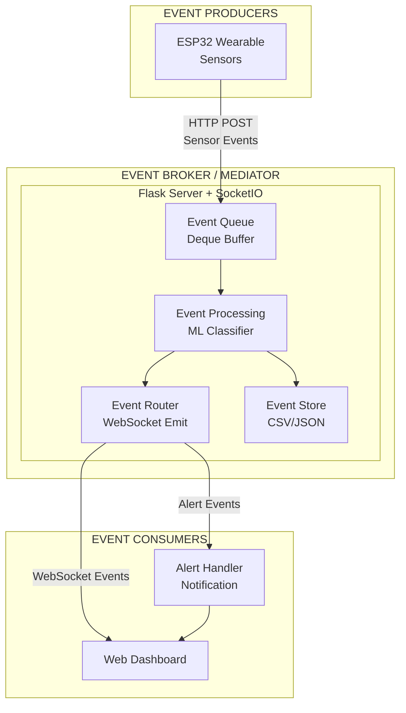

---

## 2. Three-Tier Architecture

| Tier | Component | Technology | Description |
|------|-----------|------------|-------------|
| **Hardware / Sensor Layer** | Wearable Device | ESP32 + AD8232 + MPU6050 + NEO-6M | Collects ECG, motion, and GPS data; performs on-device signal processing; transmits JSON over Wi-Fi |
| **Application / Server Layer** | Flask Server | Python, Flask, Flask-SocketIO, scikit-learn, XGBoost, joblib | Receives sensor data, computes windowed features, runs ML inference, manages alerts, pushes updates via WebSocket |
| **Presentation Layer** | Web Dashboard | HTML5, CSS3, JavaScript, Bootstrap 5, Chart.js, Leaflet.js, Socket.IO | Displays real-time status, charts, GPS map, alerts, and event log |

---

## 3. Hardware Architecture

### 3.1 Sensor Specifications

| Sensor | Model | Interface | Placement | Sampling Rate | Purpose |
|--------|-------|-----------|-----------|---------------|---------|
| ECG | AD8232 | Analog (GPIO34) | Chest (3-electrode) | ~166 Hz (internal) | Heart rate, HRV |
| IMU | MPU6050 | I2C (GPIO21/22) | Chest/Sternum | Per-cycle (~166 Hz) | Motion, orientation, fall detection |
| GPS | NEO-6M | UART2 (GPIO16/17) | Shoulder | 1 Hz (GPS standard) | Location tracking |
| MCU | ESP32 | — | Waist belt | — | Central processing + Wi-Fi transmission |

### 3.2 Wiring Diagram

| Pin | Connection |
|-----|------------|
| GPIO34 | AD8232 OUTPUT (ECG analog) |
| GPIO32 | AD8232 LO+ (lead-off detect) |
| GPIO33 | AD8232 LO- (lead-off detect) |
| GPIO21 | MPU6050 SDA (I2C data) |
| GPIO22 | MPU6050 SCL (I2C clock) |
| GPIO16 | NEO-6M TX → ESP32 RX2 |
| GPIO17 | NEO-6M RX ← ESP32 TX2 |

### 3.3 On-Device Processing Pipeline

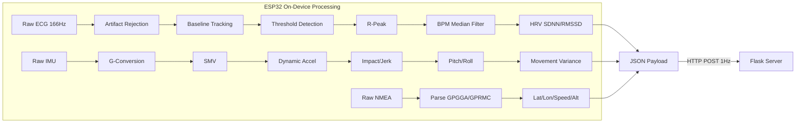

---

## 4. Software Architecture

### 4.1 Component Summary

| Component | File | Role |
|-----------|------|------|
| ESP32 Firmware | `esp32_sensor_code.ino` | Sensor reading, signal processing, Wi-Fi transmission |
| Data Collection Server | `data_collection.py` | Labeled data collection for training |
| Model Training Pipeline | `model_training.py` | Data cleaning, training 4 models, evaluation, model selection |
| Real-Time Dashboard Server | `realtime_dashboard.py` | Live inference, alerting, WebSocket push |
| Dashboard UI | `templates/dashboard.html` | Single-page real-time visualization |
| Dataset Analysis | `analyze_dataset.py` | Statistical analysis of collected data |

### 4.2 ML Pipeline Architecture

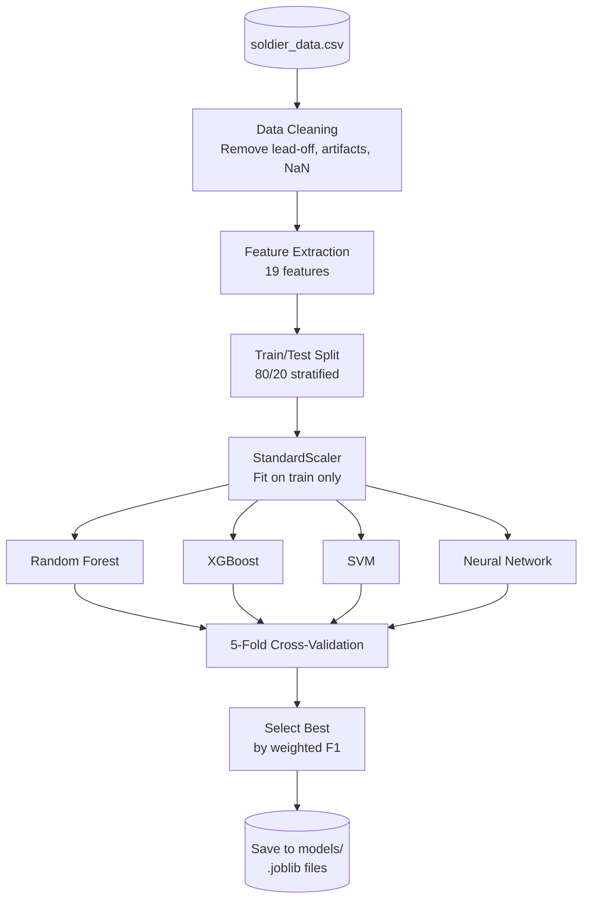

### 4.3 Real-Time Inference Flow

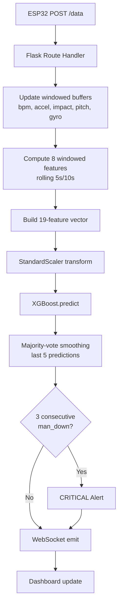

---

## 5. Data Architecture

### 5.1 Sensor Data Schema (JSON from ESP32)

```json
{
  "bpm": 72.5,
  "hrv_sdnn": 45.2,
  "hrv_rmssd": 38.1,
  "smv": 1.02,
  "dynamic_accel": 0.02,
  "impact": 0.15,
  "pitch": 5.3,
  "roll": -2.1,
  "gx": 1.2,
  "gy": -0.5,
  "gz": 0.8,
  "movement_var": 0.0003,
  "gps_lat": 28.6139,
  "gps_lon": 77.2090,
  "gps_speed": 0.0,
  "gps_alt": 216.0,
  "gps_satellites": 7,
  "gps_fix": 1,
  "ecg_lead_off": 0
}
```

### 5.2 Training Dataset Schema (soldier_data.csv)

| Column | Type | Description |
|--------|------|-------------|
| timestamp | float | Unix timestamp |
| session_id | string | Unique session identifier |
| subject_id | string | Volunteer identifier |
| bpm ... movement_var | float | 11 raw sensor features |
| bpm_mean_10s ... gyro_magnitude_mean_5s | float | 8 windowed features |
| gps_lat ... gps_fix | float/bool | GPS context data |
| label | string | Ground truth class label |

### 5.3 Model Artifacts (models/ directory)

| File | Format | Description |
|------|--------|-------------|
| best_model.joblib | Joblib | Trained XGBoost classifier |
| scaler.joblib | Joblib | StandardScaler fitted on training data |
| label_encoder.joblib | Joblib | LabelEncoder for class names |
| feature_names.joblib | Joblib | Ordered list of 19 feature names |
| model_metadata.json | JSON | Model name, accuracy, F1, training timestamp |
| training_report.txt | Text | Full comparison report of all 4 models |

---

## 6. Communication Protocols

| Link | Protocol | Format | Frequency |
|------|----------|--------|-----------|
| ESP32 → Server | HTTP POST (Wi-Fi) | JSON | 1 Hz (1000ms) |
| Server → Dashboard | WebSocket (Socket.IO) | JSON | ~1 Hz |
| Dashboard → Server | WebSocket events | — | On-demand (clear alert, request history) |
| Server REST APIs | HTTP GET | JSON | On-demand (`/api/state`, `/api/history`, `/api/events`, `/api/model`) |

---

## 7. Technology Stack Summary

| Layer | Technology |
|-------|-----------|
| Microcontroller | ESP32 (Arduino C++) |
| ECG Front-End | AD8232 |
| IMU | MPU6050 (I2C) |
| GPS | NEO-6M (UART/NMEA) |
| Backend Server | Python 3, Flask 3.0, Flask-SocketIO 5.3 |
| ML Framework | scikit-learn 1.3, XGBoost 2.0 |
| Data Processing | Pandas 2.0, NumPy 1.24 |
| Model Persistence | Joblib 1.3 |
| Frontend | HTML5, CSS3, JavaScript (ES6) |
| UI Framework | Bootstrap 5.3 |
| Charting | Chart.js 4.4 |
| Mapping | Leaflet.js 1.9 |
| Real-Time Comms | Socket.IO 4.7 |
| Visualization (Training) | Matplotlib 3.7, Seaborn 0.12 |

---

## 8. Use Case Diagram

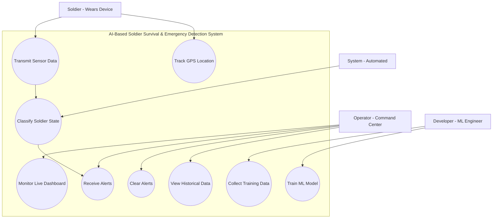

---

## 9. Class Diagram

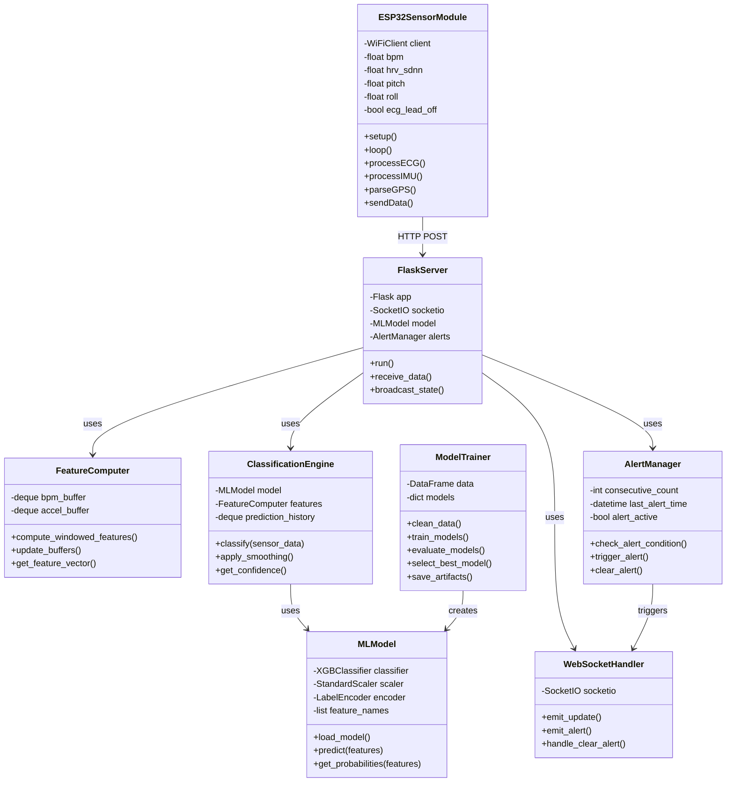

---

## 10. Data Flow Diagram

### Level 0 - Context Diagram

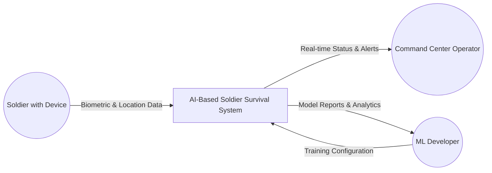

### Level 1 - Main Processes

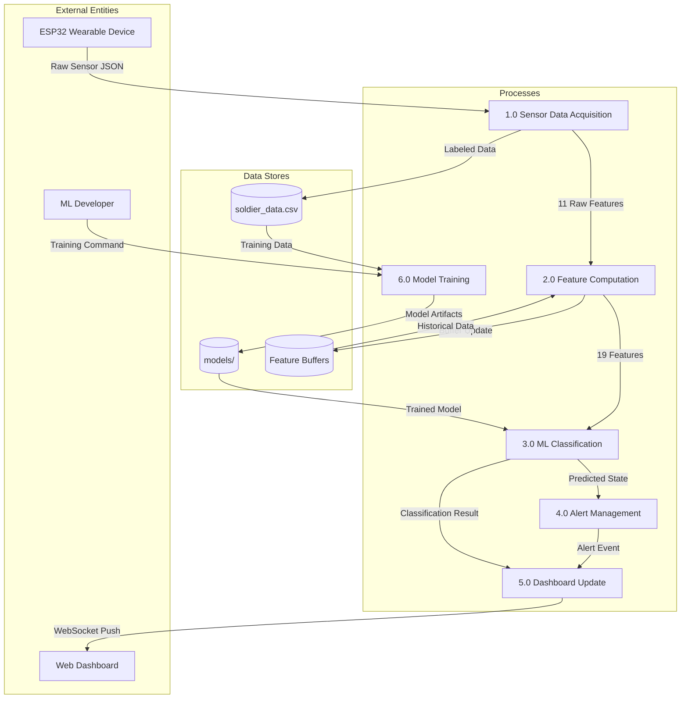

---

## 11. Component Diagram

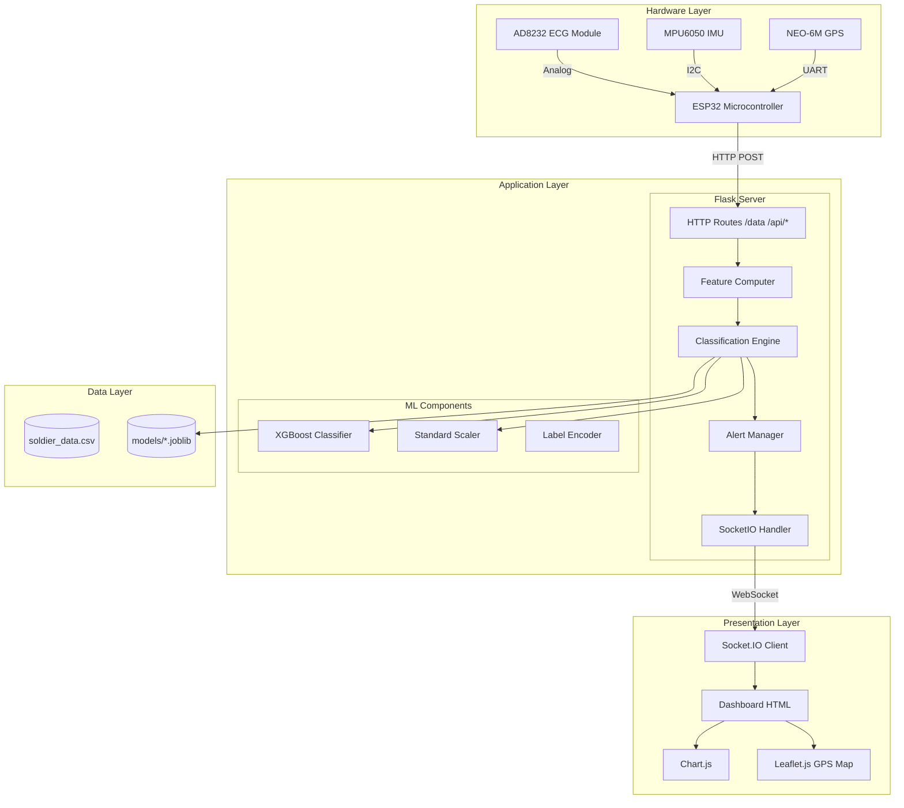

---

## 12. Sequence Diagram

### Real-Time Classification Flow

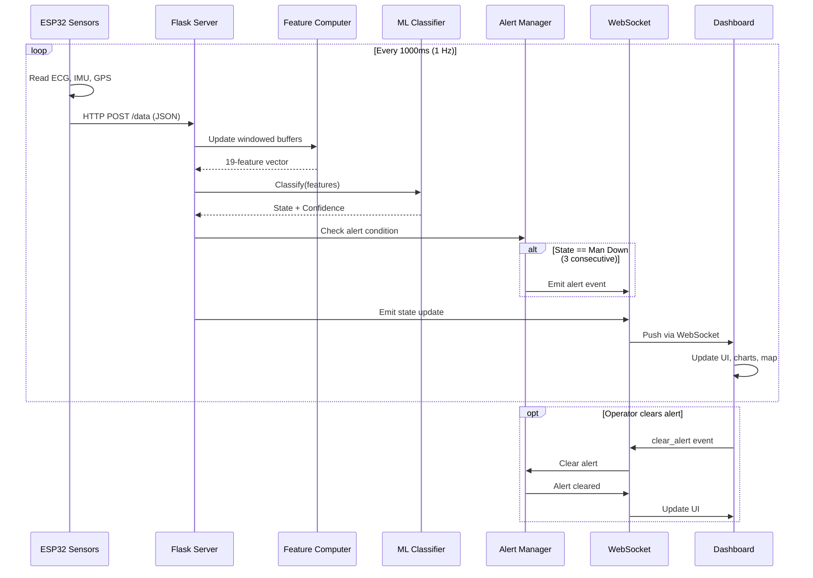

### Model Training Flow

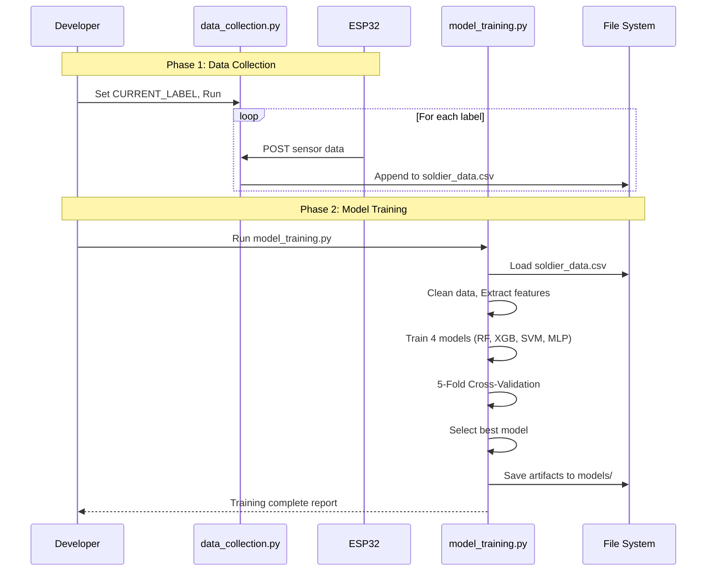

---

## 13. Deployment Diagram

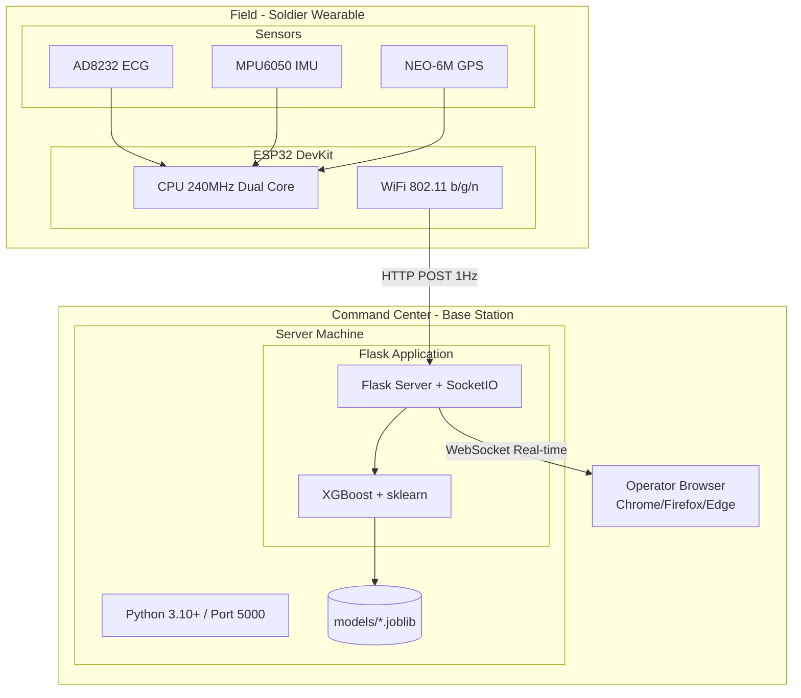

---

## 14. ER Diagram

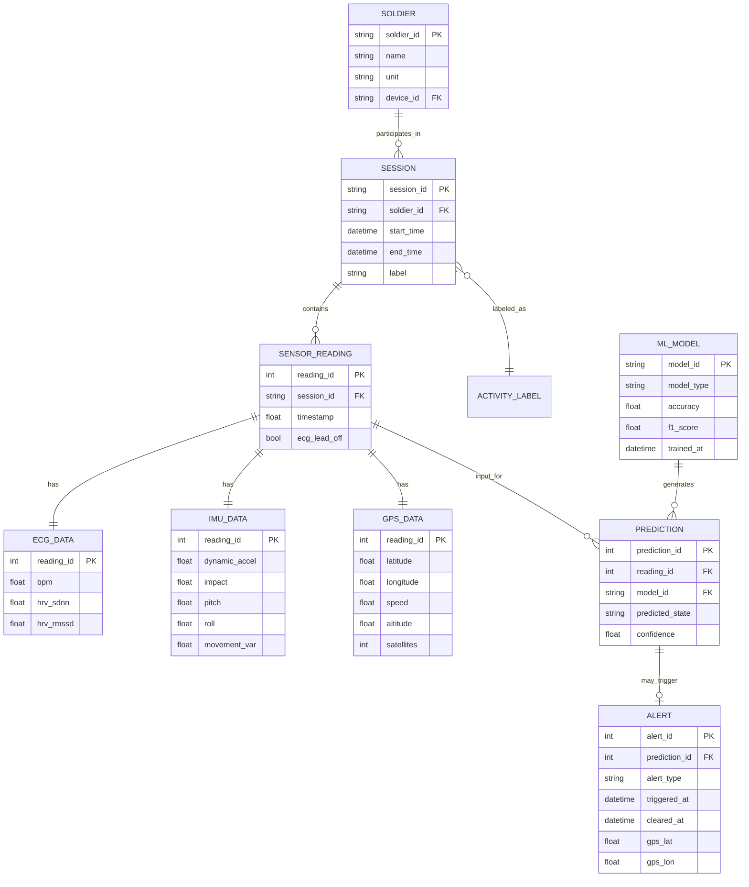

---

## 15. Schema Design

### Training Dataset Schema (soldier_data.csv)

```sql
CREATE TABLE sensor_readings (
    timestamp         DECIMAL(18,6) PRIMARY KEY,
    session_id        VARCHAR(50) NOT NULL,
    subject_id        VARCHAR(20) NOT NULL,
    
    -- ECG Features
    bpm               DECIMAL(5,2),
    hrv_sdnn          DECIMAL(6,2),
    hrv_rmssd         DECIMAL(6,2),
    ecg_lead_off      BOOLEAN DEFAULT FALSE,
    
    -- IMU Features
    smv               DECIMAL(6,4),
    dynamic_accel     DECIMAL(6,4),
    impact            DECIMAL(6,4),
    pitch             DECIMAL(6,2),
    roll              DECIMAL(6,2),
    gx                DECIMAL(8,2),
    gy                DECIMAL(8,2),
    gz                DECIMAL(8,2),
    movement_var      DECIMAL(10,8),
    
    -- Windowed Features
    bpm_mean_10s             DECIMAL(5,2),
    bpm_std_10s              DECIMAL(5,2),
    dynamic_accel_mean_5s    DECIMAL(6,4),
    dynamic_accel_max_5s     DECIMAL(6,4),
    impact_max_5s            DECIMAL(6,4),
    pitch_mean_5s            DECIMAL(6,2),
    movement_var_mean_5s     DECIMAL(10,8),
    gyro_magnitude_mean_5s   DECIMAL(8,2),
    
    -- GPS
    gps_lat           DECIMAL(10,7),
    gps_lon           DECIMAL(11,7),
    gps_speed         DECIMAL(6,2),
    gps_alt           DECIMAL(7,2),
    gps_satellites    TINYINT,
    gps_fix           BOOLEAN,
    
    -- Label
    label             VARCHAR(20) NOT NULL
);
```

---

## 16. Data Exchange Contract

### Frequency of Data Exchanges

| Exchange | Direction | Frequency | Trigger |
|----------|-----------|-----------|---------|
| Sensor Data | ESP32 → Server | 1 Hz (1000ms) | Timer-based |
| Dashboard Update | Server → Dashboard | 1 Hz (1000ms) | On sensor receipt |
| Alert Notification | Server → Dashboard | Event-driven | On alert trigger |
| Alert Clear | Dashboard → Server | Event-driven | User action |
| Status Request | Dashboard → Server | On-demand | API call |

### Data Sets

**Sensor Data Payload (ESP32 → Server):**
```json
{
    "bpm": 72.5, "hrv_sdnn": 45.2, "hrv_rmssd": 38.1,
    "smv": 1.02, "dynamic_accel": 0.02, "impact": 0.15,
    "pitch": 5.3, "roll": -2.1,
    "gx": 1.2, "gy": -0.5, "gz": 0.8,
    "movement_var": 0.0003,
    "gps_lat": 28.6139, "gps_lon": 77.2090,
    "gps_speed": 0.0, "gps_alt": 216.0,
    "gps_satellites": 7, "gps_fix": 1,
    "ecg_lead_off": 0
}
```

**Dashboard Update Payload (Server → Dashboard via WebSocket):**
```json
{
    "status": "normal",
    "confidence": {"normal": 0.95, "high_exertion": 0.03, "man_down": 0.02},
    "vitals": {"bpm": 72.5, "hrv_sdnn": 45.2, "hrv_rmssd": 38.1},
    "motion": {"dynamic_accel": 0.02, "impact": 0.15, "pitch": 5.3, "roll": -2.1},
    "gps": {"lat": 28.6139, "lon": 77.2090, "speed": 0.0},
    "alert_active": false,
    "timestamp": 1772701958.123
}
```

### Mode of Exchanges

| # | Exchange | Mode | Format | Protocol |
|---|----------|------|--------|----------|
| 1 | Sensor Data | HTTP POST | JSON | REST API |
| 2 | Dashboard Update | WebSocket Push | JSON | Socket.IO |
| 3 | Alert Notification | WebSocket Push | JSON | Socket.IO |
| 4 | Alert Clear | WebSocket Event | JSON | Socket.IO |
| 5 | Historical Data | HTTP GET | JSON | REST API |
| 6 | Training Data | File Write | CSV | File System |
| 7 | Model Artifacts | File Read/Write | Joblib | File System |

### Data Exchange Diagram

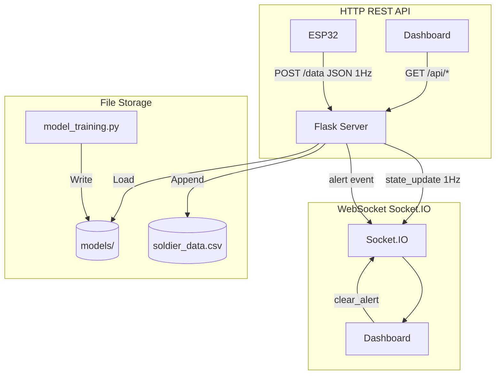

---
