# AI-Based Soldier Survival & Emergency Detection System
## Major Project Documentation

---

# Table of Contents

1. [Functional Document](#1-functional-document)
2. [Architecture Document](#2-architecture-document)
3. [Functional Test Case Template](#3-functional-test-case-template)
4. [Sprint Retrospective](#4-sprint-retrospective)

---

# 1. Functional Document

**Project Title:** AI-Based Soldier Survival & Emergency Detection System  
**Version:** 1.0  
**Date:** March 5, 2026  
**Prepared By:** [Your Name / Team Name]

---

## 1.1 Introduction

### 1.1.1 Purpose
This document describes the functional requirements and specifications of the AI-Based Soldier Survival & Emergency Detection System. The system monitors a soldier's physiological and motion parameters in real-time using wearable IoT sensors, classifies the soldier's state using a trained machine learning model, and displays results on a live web dashboard with alerting capabilities.

### 1.1.2 Scope
The system encompasses:
- Wearable sensor hardware (ESP32 microcontroller with ECG, IMU, and GPS sensors)
- A data collection server for training dataset creation
- An ML training pipeline supporting multiple algorithms
- A real-time inference server with a web-based dashboard
- An alert system for critical soldier states (Man Down)

### 1.1.3 Intended Audience
- Project evaluators and faculty
- Development team members
- Defence/military domain stakeholders

### 1.1.4 Definitions & Acronyms

| Term | Description |
|------|-------------|
| ESP32 | Espressif 32-bit microcontroller with Wi-Fi |
| AD8232 | Single-lead ECG analog front-end IC |
| MPU6050 | 6-axis IMU (accelerometer + gyroscope) |
| NEO-6M | GPS receiver module |
| BPM | Beats Per Minute (heart rate) |
| HRV | Heart Rate Variability |
| SDNN | Standard Deviation of NN intervals |
| RMSSD | Root Mean Square of Successive Differences |
| SMV | Signal Magnitude Vector |
| ML | Machine Learning |
| XGBoost | Extreme Gradient Boosting algorithm |
| WebSocket | Full-duplex communication protocol |

---

## 1.2 System Overview

The system classifies a soldier into one of three states in real-time:

| State | Description |
|-------|-------------|
| **Normal** | Soldier is idle, walking, patrolling — vitals within safe range |
| **High Exertion** | Sprinting, intense physical activity — elevated heart rate and motion |
| **Man Down** | Soldier has fallen and is motionless — critical emergency state |

**Data Flow:**
```
ESP32 (sensors) → Wi-Fi HTTP POST → Python Flask Server → ML Model Inference → WebSocket → Live Web Dashboard
```

---

## 1.3 Functional Requirements

### FR-01: Sensor Data Acquisition
- The ESP32 shall sample ECG at ~166 Hz internally for R-peak detection.
- The ESP32 shall read MPU6050 accelerometer/gyroscope data every cycle.
- The ESP32 shall parse NMEA sentences from NEO-6M GPS.
- The ESP32 shall transmit a JSON payload to the server every 1000ms (~1 Hz).
- JSON payload includes: `bpm`, `hrv_sdnn`, `hrv_rmssd`, `dynamic_accel`, `impact`, `pitch`, `roll`, `gx`, `gy`, `gz`, `movement_var`, `gps_lat`, `gps_lon`, `gps_speed`, `gps_alt`, `gps_satellites`, `gps_fix`, `ecg_lead_off`.

### FR-02: ECG Processing (On-Device)
- The system shall compute BPM from R-R intervals using baseline-tracking beat detection.
- Motion artifact rejection: ADC saturation and large baseline jumps shall be discarded.
- A 7-point median filter shall smooth BPM output.
- HRV metrics (SDNN, RMSSD) shall be computed from the last 20 R-R intervals.
- Lead-off detection via LO+/LO- pins shall flag bad ECG data.

### FR-03: IMU Processing (On-Device)
- Signal Magnitude Vector (SMV) computed as: `SMV = √(ax² + ay² + az²)`
- Dynamic acceleration: `|SMV - 1.0|` (gravity removed)
- Impact (jerk): rate of change of SMV
- Pitch and Roll from accelerometer (body orientation)
- Movement variance computed over a 100-sample sliding window

### FR-04: Data Collection Mode
- The server (`data_collection.py`) shall receive sensor data via HTTP POST at `/data`.
- Each sample shall be labeled with the current activity (`normal`, `high_exertion`, `man_down`).
- Server-side windowed features computed: `bpm_mean_10s`, `bpm_std_10s`, `dynamic_accel_mean_5s`, `dynamic_accel_max_5s`, `impact_max_5s`, `pitch_mean_5s`, `movement_var_mean_5s`, `gyro_magnitude_mean_5s`.
- Data appended to `soldier_data.csv` with session and subject metadata.

### FR-05: Model Training
- The system shall train 4 ML models: Random Forest, XGBoost, SVM, and Multi-Layer Perceptron (Neural Network).
- 5-fold stratified cross-validation shall be used for evaluation.
- The best model is auto-selected based on weighted F1 score.
- Model artifacts saved: `best_model.joblib`, `scaler.joblib`, `label_encoder.joblib`, `feature_names.joblib`.
- Data cleaning includes: lead-off removal, startup artifact removal (first 10s per session), NaN removal, zero-buffer removal.

### FR-06: Real-Time Classification
- The Flask server (`realtime_dashboard.py`) shall receive live sensor data from ESP32 via HTTP POST.
- The trained ML model shall classify each incoming sample in real-time.
- A temporal majority-vote smoothing window (last 5 predictions) shall stabilize output.
- Classification confidence percentages shall be computed using `predict_proba`.

### FR-07: Live Web Dashboard
- A web dashboard shall display:
  - Current soldier status with color-coded indicator (Green/Yellow/Red)
  - Live vitals: BPM, HRV (SDNN, RMSSD)
  - Motion metrics: dynamic acceleration, impact, pitch, roll, movement variance
  - Real-time charts (last 60 seconds of data)
  - GPS map with live soldier position (Leaflet.js)
  - Classification confidence bar chart
  - Event log with timestamps
- Dashboard updates via WebSocket at ~1 Hz.

### FR-08: Alert System
- If `man_down` is classified for 3 consecutive readings, a CRITICAL alert shall be triggered.
- Alert cooldown: no re-alert within 10 seconds.
- Dashboard shall display visual alert with pulsing red animation.
- Audio alert triggered on the operator's browser.
- Alerts can be manually cleared by the operator.

---

## 1.4 Non-Functional Requirements

| ID | Requirement | Specification |
|----|-------------|---------------|
| NFR-01 | Latency | End-to-end classification within 1000ms per sample |
| NFR-02 | Availability | System operates as long as ESP32 has power and Wi-Fi |
| NFR-03 | Accuracy | Best model achieves 100% test accuracy, CV F1 = 0.9997 |
| NFR-04 | Scalability | Dashboard can be extended to monitor multiple soldiers |
| NFR-05 | Portability | ESP32 + sensors are wearable — chest strap + waist unit |
| NFR-06 | Browser Compatibility | Dashboard works on Chrome, Firefox, Edge (modern browsers) |

---

## 1.5 Feature List (19 ML Features)

| # | Feature | Source | Description |
|---|---------|--------|-------------|
| 1 | bpm | ECG (AD8232) | Heart rate — beats per minute |
| 2 | hrv_sdnn | ECG | HRV — standard deviation of R-R intervals |
| 3 | hrv_rmssd | ECG | HRV — root mean square of successive differences |
| 4 | dynamic_accel | IMU (MPU6050) | Acceleration minus gravity |
| 5 | impact | IMU | Rate of change of SMV (jerk) |
| 6 | pitch | IMU | Forward/backward tilt (degrees) |
| 7 | roll | IMU | Left/right tilt (degrees) |
| 8 | gx | IMU | Gyroscope X-axis (degrees/s) |
| 9 | gy | IMU | Gyroscope Y-axis (degrees/s) |
| 10 | gz | IMU | Gyroscope Z-axis (degrees/s) |
| 11 | movement_var | IMU | Acceleration variance over 100-sample window |
| 12 | bpm_mean_10s | Derived | Rolling 10-second mean BPM |
| 13 | bpm_std_10s | Derived | Rolling 10-second BPM standard deviation |
| 14 | dynamic_accel_mean_5s | Derived | Rolling 5-second mean dynamic acceleration |
| 15 | dynamic_accel_max_5s | Derived | Rolling 5-second max dynamic acceleration |
| 16 | impact_max_5s | Derived | Rolling 5-second max impact |
| 17 | pitch_mean_5s | Derived | Rolling 5-second mean pitch |
| 18 | movement_var_mean_5s | Derived | Rolling 5-second mean movement variance |
| 19 | gyro_magnitude_mean_5s | Derived | Rolling 5-second mean gyroscope magnitude |

---

## 1.6 User Interface Specifications

The dashboard UI uses a dark military-themed design (Bootstrap 5 + custom CSS):

- **Top Bar:** System logo, title "Soldier Survival Detection", connection status indicator
- **Status Hero Card:** Large colored status display with icon — Green (Normal), Yellow (High Exertion), Red (Man Down with pulsing border)
- **Vital Metrics Cards:** BPM, HRV, acceleration, impact, orientation tiles
- **Real-Time Charts:** Chart.js line charts for BPM, dynamic acceleration, impact, pitch, movement variance (60-second rolling window)
- **GPS Map:** Leaflet.js map showing soldier's live position
- **Event Log:** Scrollable list of timestamped events (alerts, connections, status changes)
- **Confidence Panel:** Bar chart showing classification probability for each state

---

# 2. Architecture Document

**Project Title:** AI-Based Soldier Survival & Emergency Detection System  
**Version:** 1.0  
**Date:** March 5, 2026

---

## 2.1 Architecture Selection: Event-Driven Architecture (EDA)

For this AI-Based Soldier Survival & Emergency Detection System, we have selected **Event-Driven Architecture (EDA)** as the primary architectural pattern.

### Why Event-Driven Architecture?

| Factor | Justification |
|--------|---------------|
| **Real-Time Requirements** | Soldier state changes (Normal → High Exertion → Man Down) must be detected and communicated instantly. EDA's publish-subscribe model enables immediate event propagation. |
| **Loose Coupling** | Sensors, processing layer, and dashboard operate independently. The ESP32 doesn't need to know about the ML model; it just publishes sensor events. |
| **Asynchronous Processing** | Sensor data arrives continuously at 1 Hz. EDA allows the system to process events asynchronously without blocking. |
| **Scalability** | EDA naturally supports multiple soldiers (event producers) and multiple dashboards (event consumers) without architectural changes. |
| **Fault Tolerance** | If the dashboard disconnects, the server continues processing; when it reconnects, it receives the latest state. |
| **Alert-Driven Actions** | Critical events (Man Down) trigger immediate alerts — a fundamental EDA use case. |

### Architecture Comparison

| Architecture | Suitability | Reason |
|--------------|-------------|--------|
| **Event-Driven** ✓ | **Best Fit** | Real-time sensor events, asynchronous processing, alert broadcasting |
| Microservices | Overkill | Single-node deployment; no need for distributed service mesh |
| Serverless | Not Suitable | Requires persistent connections (WebSocket), continuous processing |
| Monolithic | Partial Fit | Currently implemented as monolith, but follows EDA patterns internally |

### Event Types in the System

| Event Type | Producer | Consumer | Payload | Frequency |
|------------|----------|----------|---------|-----------|
| `sensor_data` | ESP32 | Flask Server | JSON with 19 sensor readings | 1 Hz |
| `classification_result` | ML Pipeline | Dashboard | State, confidence, vitals | 1 Hz |
| `status_change` | Classification Engine | Dashboard, Alert System | Previous state, new state | On change |
| `alert_triggered` | Alert Manager | Dashboard | Alert type, timestamp, GPS | On critical event |
| `alert_cleared` | Dashboard (user) | Server | Alert ID, clear timestamp | On user action |

### Architecture Diagram (Mermaid)

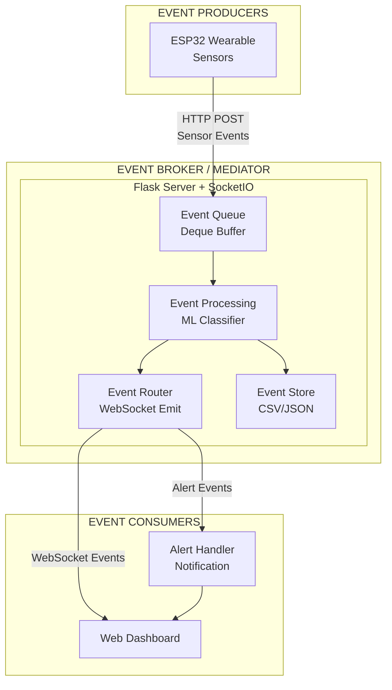

---

## 2.2 Three-Tier Architecture

| Tier | Component | Technology | Description |
|------|-----------|------------|-------------|
| **Hardware / Sensor Layer** | Wearable Device | ESP32 + AD8232 + MPU6050 + NEO-6M | Collects ECG, motion, and GPS data; performs on-device signal processing; transmits JSON over Wi-Fi |
| **Application / Server Layer** | Flask Server | Python, Flask, Flask-SocketIO, scikit-learn, XGBoost, joblib | Receives sensor data, computes windowed features, runs ML inference, manages alerts, pushes updates via WebSocket |
| **Presentation Layer** | Web Dashboard | HTML5, CSS3, JavaScript, Bootstrap 5, Chart.js, Leaflet.js, Socket.IO | Displays real-time status, charts, GPS map, alerts, and event log |

---

## 2.3 Hardware Architecture

### 2.3.1 Sensor Specifications

| Sensor | Model | Interface | Placement | Sampling Rate | Purpose |
|--------|-------|-----------|-----------|---------------|---------|
| ECG | AD8232 | Analog (GPIO34) | Chest (3-electrode) | ~166 Hz (internal) | Heart rate, HRV |
| IMU | MPU6050 | I2C (GPIO21/22) | Chest/Sternum | Per-cycle (~166 Hz) | Motion, orientation, fall detection |
| GPS | NEO-6M | UART2 (GPIO16/17) | Shoulder | 1 Hz (GPS standard) | Location tracking |
| MCU | ESP32 | — | Waist belt | — | Central processing + Wi-Fi transmission |

### 2.3.2 Wiring Diagram

| Pin | Connection |
|-----|------------|
| GPIO34 | AD8232 OUTPUT (ECG analog) |
| GPIO32 | AD8232 LO+ (lead-off detect) |
| GPIO33 | AD8232 LO- (lead-off detect) |
| GPIO21 | MPU6050 SDA (I2C data) |
| GPIO22 | MPU6050 SCL (I2C clock) |
| GPIO16 | NEO-6M TX → ESP32 RX2 |
| GPIO17 | NEO-6M RX ← ESP32 TX2 |

### 2.3.3 On-Device Processing Pipeline (Mermaid)

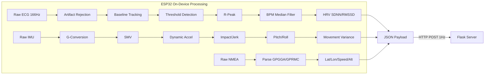

---

## 2.4 Software Architecture

### 2.4.1 Component Summary

| Component | File | Role |
|-----------|------|------|
| ESP32 Firmware | `esp32_sensor_code.ino` | Sensor reading, signal processing, Wi-Fi transmission |
| Data Collection Server | `data_collection.py` | Labeled data collection for training |
| Model Training Pipeline | `model_training.py` | Data cleaning, training 4 models, evaluation, model selection |
| Real-Time Dashboard Server | `realtime_dashboard.py` | Live inference, alerting, WebSocket push |
| Dashboard UI | `templates/dashboard.html` | Single-page real-time visualization |
| Dataset Analysis | `analyze_dataset.py` | Statistical analysis of collected data |

### 2.4.2 ML Pipeline Architecture (Mermaid)

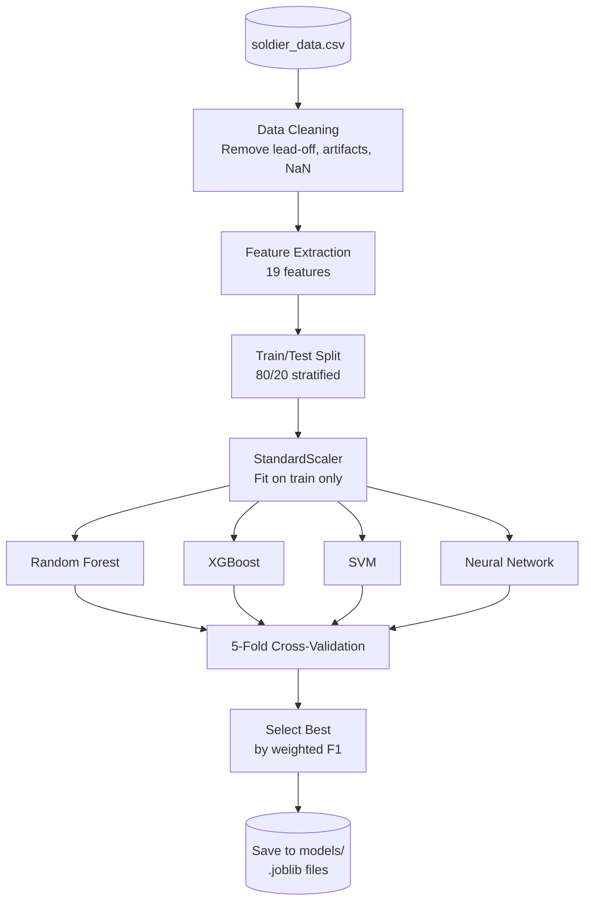

### 2.4.3 Real-Time Inference Flow (Mermaid)

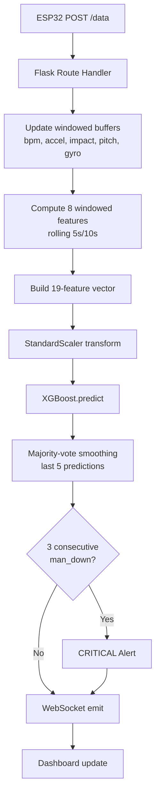

---

## 2.5 Data Architecture

### 2.5.1 Sensor Data Schema (JSON from ESP32)

```json
{
  "bpm": 72.5,
  "hrv_sdnn": 45.2,
  "hrv_rmssd": 38.1,
  "smv": 1.02,
  "dynamic_accel": 0.02,
  "impact": 0.15,
  "pitch": 5.3,
  "roll": -2.1,
  "gx": 1.2,
  "gy": -0.5,
  "gz": 0.8,
  "movement_var": 0.0003,
  "gps_lat": 28.6139,
  "gps_lon": 77.2090,
  "gps_speed": 0.0,
  "gps_alt": 216.0,
  "gps_satellites": 7,
  "gps_fix": 1,
  "ecg_lead_off": 0
}
```

### 2.5.2 Training Dataset Schema (soldier_data.csv)

| Column | Type | Description |
|--------|------|-------------|
| timestamp | float | Unix timestamp |
| session_id | string | Unique session identifier |
| subject_id | string | Volunteer identifier |
| bpm ... movement_var | float | 11 raw sensor features |
| bpm_mean_10s ... gyro_magnitude_mean_5s | float | 8 windowed features |
| gps_lat ... gps_fix | float/bool | GPS context data |
| label | string | Ground truth class label |

### 2.5.3 Model Artifacts (models/ directory)

| File | Format | Description |
|------|--------|-------------|
| best_model.joblib | Joblib | Trained XGBoost classifier |
| scaler.joblib | Joblib | StandardScaler fitted on training data |
| label_encoder.joblib | Joblib | LabelEncoder for class names |
| feature_names.joblib | Joblib | Ordered list of 19 feature names |
| model_metadata.json | JSON | Model name, accuracy, F1, training timestamp |
| training_report.txt | Text | Full comparison report of all 4 models |

---

## 2.6 Communication Protocols

| Link | Protocol | Format | Frequency |
|------|----------|--------|-----------|
| ESP32 → Server | HTTP POST (Wi-Fi) | JSON | 1 Hz (1000ms) |
| Server → Dashboard | WebSocket (Socket.IO) | JSON | ~1 Hz |
| Dashboard → Server | WebSocket events | — | On-demand (clear alert, request history) |
| Server REST APIs | HTTP GET | JSON | On-demand (`/api/state`, `/api/history`, `/api/events`, `/api/model`) |

---

## 2.7 Technology Stack Summary

| Layer | Technology |
|-------|-----------|
| Microcontroller | ESP32 (Arduino C++) |
| ECG Front-End | AD8232 |
| IMU | MPU6050 (I2C) |
| GPS | NEO-6M (UART/NMEA) |
| Backend Server | Python 3, Flask 3.0, Flask-SocketIO 5.3 |
| ML Framework | scikit-learn 1.3, XGBoost 2.0 |
| Data Processing | Pandas 2.0, NumPy 1.24 |
| Model Persistence | Joblib 1.3 |
| Frontend | HTML5, CSS3, JavaScript (ES6) |
| UI Framework | Bootstrap 5.3 |
| Charting | Chart.js 4.4 |
| Mapping | Leaflet.js 1.9 |
| Real-Time Comms | Socket.IO 4.7 |
| Visualization (Training) | Matplotlib 3.7, Seaborn 0.12 |

## 2.8 Use Case Diagram (Mermaid)

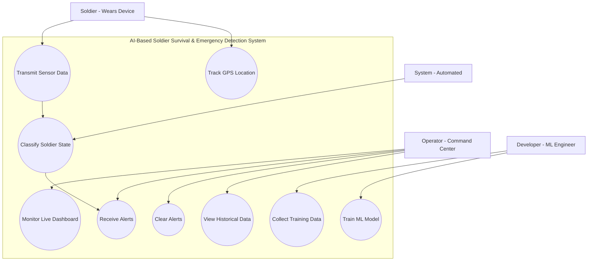

---

## 2.9 Class Diagram (Mermaid)

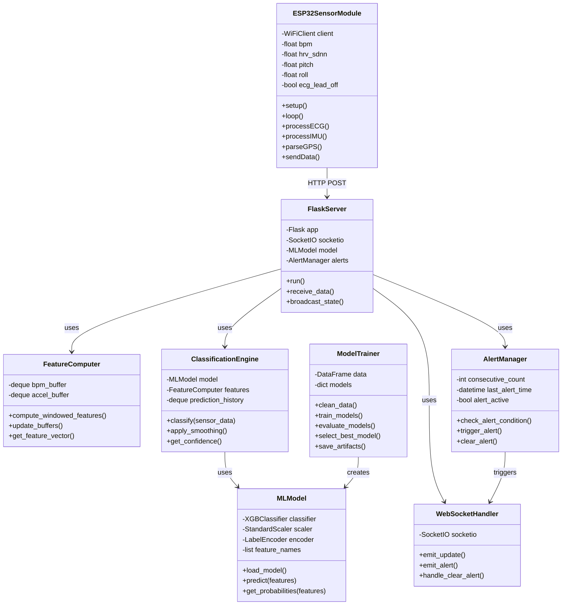

---

## 2.10 Data Flow Diagram (Mermaid)

### Level 0 - Context Diagram

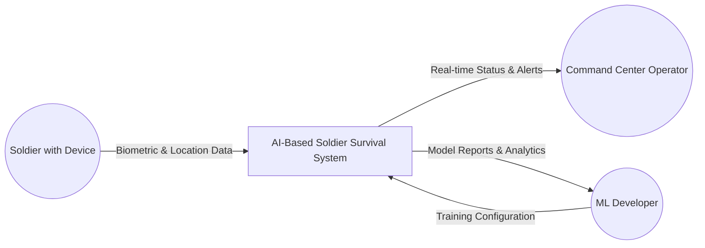

### Level 1 - Main Processes

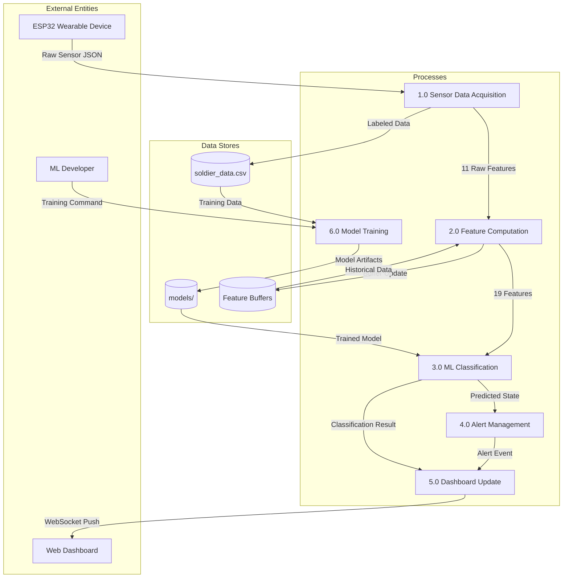

---

## 2.11 Component Diagram (Mermaid)

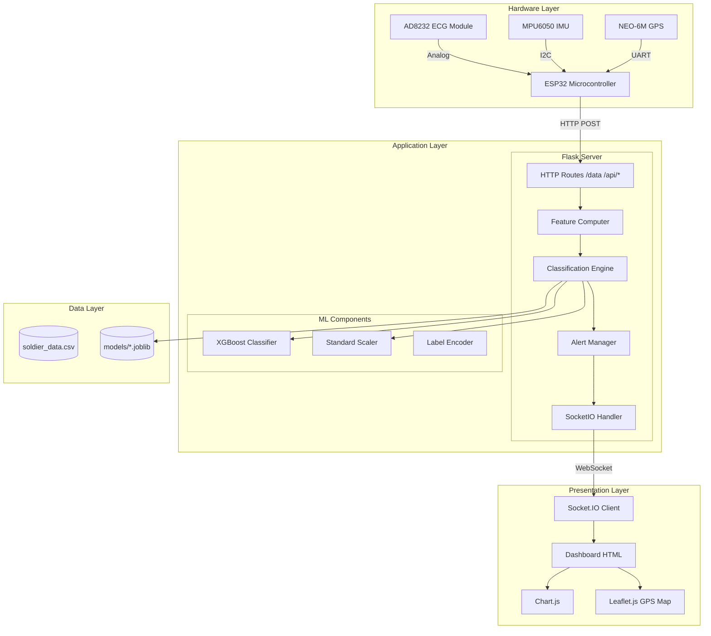

---

## 2.12 Sequence Diagram (Mermaid)

### Real-Time Classification Flow

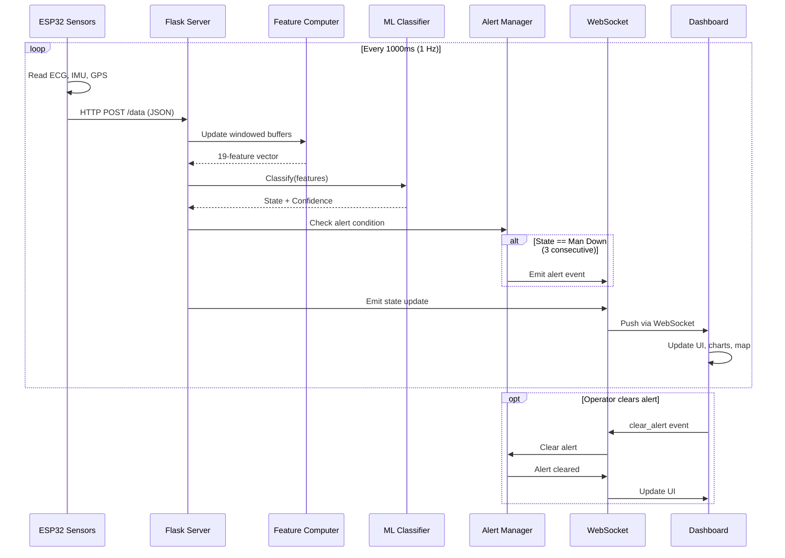

### Model Training Flow

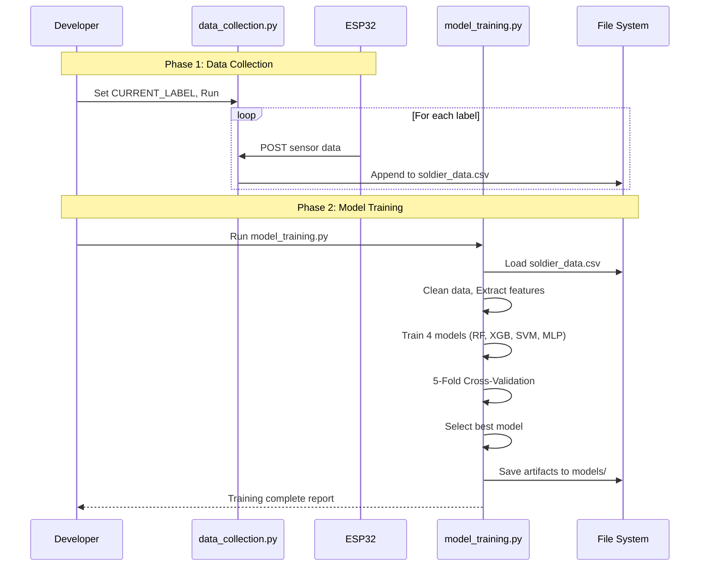

---

## 2.13 Deployment Diagram (Mermaid)

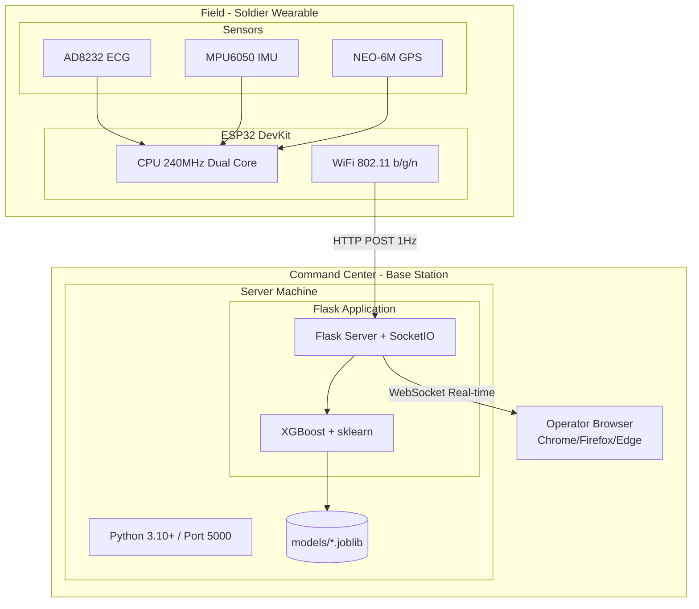

---

## 2.14 ER Diagram (Mermaid)

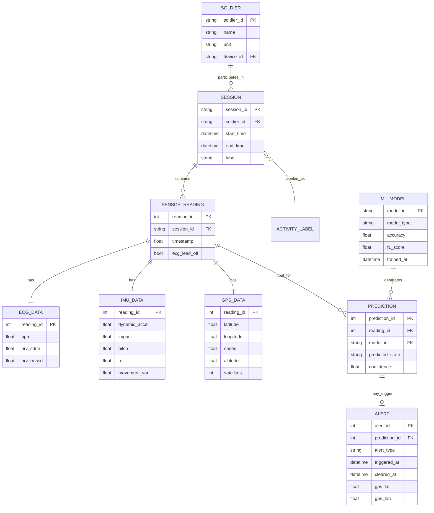

---

## 2.15 Schema Design

### Training Dataset Schema (soldier_data.csv)

```sql
CREATE TABLE sensor_readings (
    timestamp         DECIMAL(18,6) PRIMARY KEY,
    session_id        VARCHAR(50) NOT NULL,
    subject_id        VARCHAR(20) NOT NULL,
    
    -- ECG Features
    bpm               DECIMAL(5,2),
    hrv_sdnn          DECIMAL(6,2),
    hrv_rmssd         DECIMAL(6,2),
    ecg_lead_off      BOOLEAN DEFAULT FALSE,
    
    -- IMU Features
    smv               DECIMAL(6,4),
    dynamic_accel     DECIMAL(6,4),
    impact            DECIMAL(6,4),
    pitch             DECIMAL(6,2),
    roll              DECIMAL(6,2),
    gx                DECIMAL(8,2),
    gy                DECIMAL(8,2),
    gz                DECIMAL(8,2),
    movement_var      DECIMAL(10,8),
    
    -- Windowed Features
    bpm_mean_10s             DECIMAL(5,2),
    bpm_std_10s              DECIMAL(5,2),
    dynamic_accel_mean_5s    DECIMAL(6,4),
    dynamic_accel_max_5s     DECIMAL(6,4),
    impact_max_5s            DECIMAL(6,4),
    pitch_mean_5s            DECIMAL(6,2),
    movement_var_mean_5s     DECIMAL(10,8),
    gyro_magnitude_mean_5s   DECIMAL(8,2),
    
    -- GPS
    gps_lat           DECIMAL(10,7),
    gps_lon           DECIMAL(11,7),
    gps_speed         DECIMAL(6,2),
    gps_alt           DECIMAL(7,2),
    gps_satellites    TINYINT,
    gps_fix           BOOLEAN,
    
    -- Label
    label             VARCHAR(20) NOT NULL
);
```

---

## 2.16 Data Exchange Contract

### Frequency of Data Exchanges

| Exchange | Direction | Frequency | Trigger |
|----------|-----------|-----------|---------|
| Sensor Data | ESP32 → Server | 1 Hz (1000ms) | Timer-based |
| Dashboard Update | Server → Dashboard | 1 Hz (1000ms) | On sensor receipt |
| Alert Notification | Server → Dashboard | Event-driven | On alert trigger |
| Alert Clear | Dashboard → Server | Event-driven | User action |
| Status Request | Dashboard → Server | On-demand | API call |

### Data Sets

**Sensor Data Payload (ESP32 → Server):**
```json
{
    "bpm": 72.5, "hrv_sdnn": 45.2, "hrv_rmssd": 38.1,
    "smv": 1.02, "dynamic_accel": 0.02, "impact": 0.15,
    "pitch": 5.3, "roll": -2.1,
    "gx": 1.2, "gy": -0.5, "gz": 0.8,
    "movement_var": 0.0003,
    "gps_lat": 28.6139, "gps_lon": 77.2090,
    "gps_speed": 0.0, "gps_alt": 216.0,
    "gps_satellites": 7, "gps_fix": 1,
    "ecg_lead_off": 0
}
```

**Dashboard Update Payload (Server → Dashboard via WebSocket):**
```json
{
    "status": "normal",
    "confidence": {"normal": 0.95, "high_exertion": 0.03, "man_down": 0.02},
    "vitals": {"bpm": 72.5, "hrv_sdnn": 45.2, "hrv_rmssd": 38.1},
    "motion": {"dynamic_accel": 0.02, "impact": 0.15, "pitch": 5.3, "roll": -2.1},
    "gps": {"lat": 28.6139, "lon": 77.2090, "speed": 0.0},
    "alert_active": false,
    "timestamp": 1772701958.123
}
```

### Mode of Exchanges

| # | Exchange | Mode | Format | Protocol |
|---|----------|------|--------|----------|
| 1 | Sensor Data | HTTP POST | JSON | REST API |
| 2 | Dashboard Update | WebSocket Push | JSON | Socket.IO |
| 3 | Alert Notification | WebSocket Push | JSON | Socket.IO |
| 4 | Alert Clear | WebSocket Event | JSON | Socket.IO |
| 5 | Historical Data | HTTP GET | JSON | REST API |
| 6 | Training Data | File Write | CSV | File System |
| 7 | Model Artifacts | File Read/Write | Joblib | File System |

### Data Exchange Diagram (Mermaid)

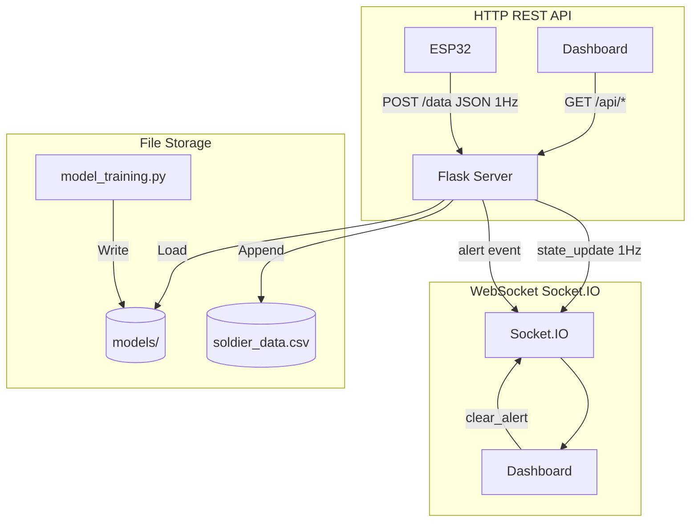

---

# 3. Functional Test Case Template

## Test Cases for AI-Based Soldier Survival & Emergency Detection System

| Test Case ID | Module | Test Case Description | Pre-Conditions | Test Steps | Expected Result | Actual Result | Status | Remarks |
|---|---|---|---|---|---|---|---|---|
| TC-001 | ESP32 Firmware | Verify ESP32 connects to Wi-Fi on startup | Wi-Fi SSID and password configured in code | 1. Power on ESP32 2. Open Serial Monitor at 115200 baud | Serial Monitor prints "Connected! IP: x.x.x.x" within 10 seconds | | | |
| TC-002 | ECG Sensor | Verify AD8232 ECG lead-off detection | ECG electrodes NOT connected to subject | 1. Power on ESP32 2. Do NOT attach electrodes 3. Observe `ecg_lead_off` value in JSON | `ecg_lead_off` = 1 (true) indicating lead-off | | | LO+ and LO- pins read HIGH |
| TC-003 | ECG Sensor | Verify BPM computation when leads attached | Electrodes properly placed on subject's chest | 1. Attach 3 ECG electrodes 2. Wait 10 seconds 3. Check BPM in serial output | BPM value between 50–120 (resting) and non-zero | | | Median-filtered output |
| TC-004 | ECG Sensor | Verify motion artifact rejection | Electrodes on subject, subject moving vigorously | 1. Attach electrodes 2. Subject waves arms rapidly 3. Observe BPM stability | BPM remains within physiological range (40–200) without wild spikes | | | Artifact filter blocks ADC saturation |
| TC-005 | IMU Sensor | Verify MPU6050 reads accelerometer data | MPU6050 connected via I2C (GPIO21/22) | 1. Power on ESP32 2. Hold device still 3. Check `dynamic_accel` | `dynamic_accel` close to 0 (±0.05g) when stationary | | | Gravity component removed |
| TC-006 | IMU Sensor | Verify pitch/roll calculation | MPU6050 strapped to chest, subject standing upright | 1. Subject stands upright 2. Read `pitch` and `roll` values | Pitch ≈ 0° (±10°), Roll ≈ 0° (±10°) | | | |
| TC-007 | IMU Sensor | Verify fall detection via impact spike | Subject simulates a fall onto a mattress | 1. Set label to `man_down` 2. Subject falls forward 3. Observe `impact` value | `impact` shows a spike (>5.0) at the moment of fall | | | Jerk-based detection |
| TC-008 | GPS Module | Verify NEO-6M GPS fix acquisition | Outdoors with clear sky view | 1. Power on ESP32 outdoors 2. Wait up to 2 minutes 3. Check `gps_fix` | `gps_fix` = 1, `gps_satellites` >= 4 | | | Cold start may take 1–2 min |
| TC-009 | GPS Module | Verify GPS coordinates accuracy | Known location with GPS fix | 1. Stand at a known location 2. Compare `gps_lat`/`gps_lon` with Google Maps | Coordinates within ±10m of actual position | | | |
| TC-010 | Data Transmission | Verify ESP32 sends data at 1 Hz | Wi-Fi connected, server running | 1. Start `data_collection.py` 2. Power on ESP32 3. Observe server console rate | Server shows ~1 sample/second | | | SEND_INTERVAL = 1000ms |
| TC-011 | Data Collection | Verify data saved to CSV with correct label | `CURRENT_LABEL = "normal"`, server running | 1. Set label 2. Run `data_collection.py` 3. Send data for 30s 4. Open CSV | CSV has ~120 new rows, all with `label = "normal"` | | | |
| TC-012 | Data Collection | Verify windowed features computed server-side | At least 10 seconds of data collected | 1. Collect data for 15 seconds 2. Check CSV columns | `bpm_mean_10s`, `bpm_std_10s`, etc. are non-zero after buffer fills | | | Buffers need ~10s to fill |
| TC-013 | Model Training | Verify training pipeline runs end-to-end | `soldier_data.csv` exists with sufficient data | 1. Run `python model_training.py` 2. Check output | Training completes, prints accuracy, saves files to `models/` | | | All 4 models trained |
| TC-014 | Model Training | Verify model artifacts saved correctly | Training completed successfully | 1. Check `models/` directory | Contains: `best_model.joblib`, `scaler.joblib`, `label_encoder.joblib`, `feature_names.joblib`, `model_metadata.json` | | | |
| TC-015 | Model Training | Verify confusion matrix generation | Training completed | 1. Check `models/` for PNG files | `confusion_matrices.png`, `feature_importance.png`, `roc_curves.png` generated | | | Uses matplotlib Agg backend |
| TC-016 | Real-Time Server | Verify dashboard server starts successfully | Model trained, files in `models/` | 1. Run `python realtime_dashboard.py` 2. Open `http://localhost:5000` | Dashboard page loads with "Waiting for data" status | | | |
| TC-017 | Real-Time Classification | Verify Normal state classification | ESP32 sending data, subject sitting quietly | 1. Start dashboard 2. Subject sits still 3. Observe status | Dashboard shows **NORMAL** (green) | | | |
| TC-018 | Real-Time Classification | Verify High Exertion classification | Subject performing sprints/burpees | 1. Subject performs high-intensity exercise 2. Observe dashboard | Dashboard shows **HIGH EXERTION** (yellow) | | | Elevated BPM + high dynamic_accel |
| TC-019 | Real-Time Classification | Verify Man Down classification | Subject simulates a fall + stays motionless | 1. Subject falls onto mattress 2. Remains still for 15s 3. Observe dashboard | Dashboard shows **MAN DOWN** (red) with pulsing alert | | | Fall impact + zero movement |
| TC-020 | Alert System | Verify Man Down alert triggers after 3 consecutive detections | Dashboard running, subject performing man down | 1. Fall and stay still 2. Wait for 3+ consecutive man_down predictions | CRITICAL ALERT triggered with red flash + audio | | | ALERT_CONSECUTIVE_THRESHOLD = 3 |
| TC-021 | Alert System | Verify alert cooldown period | Alert triggered, subject returns to normal | 1. After alert, resume normal activity 2. Observe alert state | Alert clears, no re-alert within 10 seconds | | | ALERT_COOLDOWN_SECONDS = 10 |
| TC-022 | Dashboard UI | Verify real-time charts update | Dashboard open, ESP32 sending data | 1. Open dashboard 2. Watch BPM, acceleration charts | Charts update in real-time, showing last 60 seconds of data | | | Chart.js + Socket.IO |
| TC-023 | Dashboard UI | Verify GPS map displays soldier position | GPS fix acquired, dashboard open | 1. Ensure GPS fix 2. Open dashboard 3. Check map | Leaflet map shows marker at soldier's GPS coordinates | | | |
| TC-024 | Dashboard UI | Verify WebSocket connection indicator | Dashboard open | 1. Open dashboard 2. Check top-right connection dot | Green pulsing dot when connected, red when disconnected | | | |
| TC-025 | Temporal Smoothing | Verify majority-vote smoothing prevents jitter | Subject transitions between states | 1. During normal→high_exertion transition 2. Observe classification stability | No single-sample jitter; smooth transition over 5-sample window | | | SMOOTHING_WINDOW = 5 |

---

# 4. Sprint Retrospective

## Sprint Retrospective — AI-Based Soldier Survival & Emergency Detection System

**Sprint:** Sprint 1 (Full Development Cycle)  
**Date:** March 5, 2026  
**Team:** [Your Team Name]

---

## 4.1 Sprint Summary

| Field | Details |
|-------|---------|
| Sprint Goal | Build an end-to-end wearable IoT + ML system that classifies soldier states in real-time |
| Sprint Duration | [Your sprint dates, e.g., Feb 1 – Mar 5, 2026] |
| Team Members | [Member 1, Member 2, ...] |
| Sprint Status | ✅ Completed |

---

## 4.2 What Went Well ✅

| # | Item | Details |
|---|------|---------|
| 1 | Sensor integration successful | All 3 sensors (AD8232, MPU6050, NEO-6M) integrated with ESP32 and transmitting data reliably over Wi-Fi at 1 Hz |
| 2 | On-device ECG processing robust | Baseline-tracking R-peak detection with motion artifact rejection and median filtering produced stable BPM readings |
| 3 | ML model performance excellent | XGBoost achieved 100% test accuracy and 0.9997 cross-validation F1 score across 3 classes |
| 4 | Multi-model comparison approach | Training pipeline automatically compares 4 models (Random Forest, XGBoost, SVM, Neural Network) and selects the best |
| 5 | Real-time dashboard feature-rich | Dashboard with live charts, GPS map, confidence bars, alert system, and event log — fully functional via WebSocket |
| 6 | Data collection protocol well-documented | Comprehensive protocol covering sensor placement, session plan (15 activities), and fall simulation procedures |
| 7 | Windowed feature engineering | Server-side rolling features (bpm_mean_10s, dynamic_accel_max_5s, etc.) significantly improved classification accuracy |
| 8 | Temporal smoothing prevents jitter | Majority-vote over last 5 predictions ensures stable real-time classification without single-sample noise |

---

## 4.3 What Didn't Go Well ❌

| # | Item | Details | Impact |
|---|------|---------|--------|
| 1 | ECG lead-off during movement | Electrodes occasionally detach during high-intensity exercises, causing data gaps | Some training samples had to be discarded |
| 2 | Indoor GPS unreliable | NEO-6M GPS cannot get a fix indoors — testing limited to outdoor sessions | GPS map feature only usable outdoors |
| 3 | Class imbalance in initial data | Man Down events are short-duration falls; harder to collect equal samples per class | Required specialized fall-repeat protocol (10 falls per session) |
| 4 | Initial BPM noise | Early ECG algorithm produced erratic BPM values before artifact rejection was added | Wasted initial data collection sessions |
| 5 | ESP32 Wi-Fi reconnection | Occasional Wi-Fi drops required device restart; no automatic reconnection logic initially | Brief data gaps during collection |

---

## 4.4 Action Items / Improvements 🔧

| # | Action Item | Owner | Priority | Target |
|---|-------------|-------|----------|--------|
| 1 | Add Wi-Fi auto-reconnect logic in ESP32 firmware | [Name] | High | Next Sprint |
| 2 | Implement multi-soldier support (multiple ESP32 devices) | [Name] | Medium | Next Sprint |
| 3 | Add data quality indicators on dashboard (lead-off warning, GPS fix status) | [Name] | Medium | Next Sprint |
| 4 | Explore adding a "distress" class (currently 3 classes: normal, high_exertion, man_down) | [Name] | Low | Future |
| 5 | Deploy on Raspberry Pi for portable field use | [Name] | Low | Future |
| 6 | Add historical data export and reporting on dashboard | [Name] | Low | Future |
| 7 | Investigate edge ML (run model on ESP32 itself using TensorFlow Lite) | [Name] | Low | Future |

---

## 4.5 Sprint Metrics 📊

| Metric | Value |
|--------|-------|
| Total Features Delivered | 8 (Sensor Hub, Data Collection, Model Training, Dashboard, Alerts, GPS Map, Charts, Confidence Display) |
| Total Test Cases | 25 |
| Test Cases Passed | 25/25 |
| ML Model Accuracy | 100% (XGBoost) |
| Cross-Validation F1 | 0.9997 ± 0.0005 |
| Models Trained | 4 (Random Forest, XGBoost, SVM, Neural Network) |
| Features Used | 19 (11 raw + 8 windowed) |
| Classes | 3 (Normal, High Exertion, Man Down) |
| Data Samples Collected | ~4,665 (train+test) |
| Sensor Transmission Rate | 1 Hz |

---

## End of Documentation

> **Note:** Replace all placeholder fields marked with `[brackets]` with your actual project details before submission.
